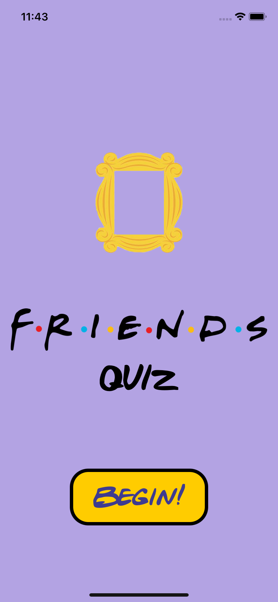
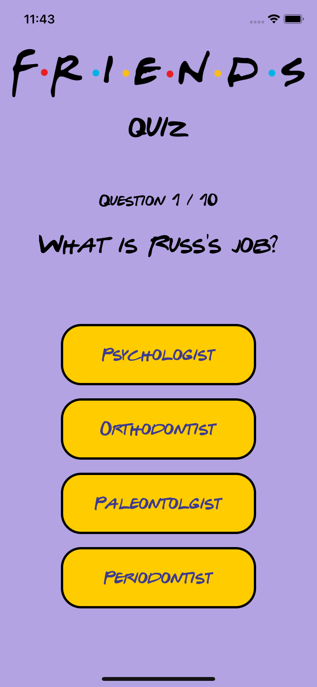
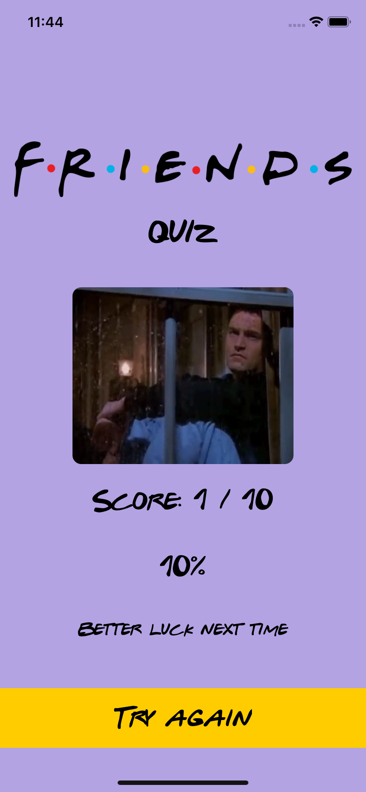

<h1 align="center">

Friends Quiz

</h1>

## Objective
My first app built using SwiftUI, a friends quiz app built following the MVVM design pattern.

## Progress
- Start screen implemented
- Question view finished
- Results View finished
- Gifs added for resultsView

## Improvements

## Testing (XCT)
- 2/2 UI Tests Passing
- 5/5 Unit Tests Passing

## Installation
1. Clone Repository

## Screenshots

## Demo

## Tech Stack
SwiftUI

## Simulator Version
iPhone 11

## Dependencies
WebKit
